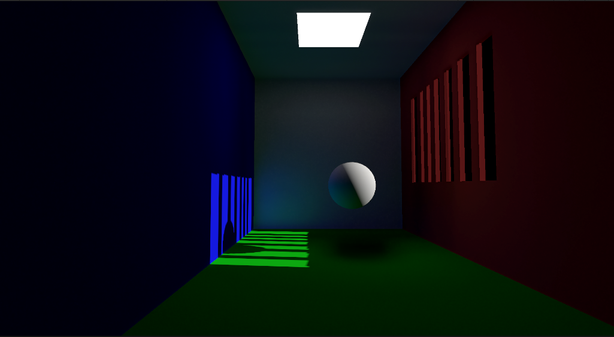

# Unity SSGI URP

这一个基于 Unity URP 的实时屏幕空间光照实验工程，主要用于研究和实现屏幕空间全局光照（SSGI）及相关渲染技术。

## 主要内容

- 基于 Forward GBuffer 的 Albedo、Metallic、World Normal 和 World Position 输出。
- 使用半球蒙特卡洛采样与屏幕空间光线步进计算间接光照。
- 支持运动矢量重投影、深度校验和逐像素时间累积。
- 使用深度与法线引导的空间滤波降低 SSGI 噪声。
- 支持半分辨率 SSGI、深度感知上采样和最终场景合成。
- 包含 Hi-Z 深度层级和屏幕空间反射（SSR）实验实现。
- 提供支持 Albedo、Roughness、Metallic 和实时阴影的简单 PBR Shader。

## 工程结构

- `Assets/Scenes/SSGIScene.unity`：SSGI 效果演示场景。
- `Assets/Scripts/Runtime/Features/`：SSGI、Forward GBuffer、Hi-Z 和 SSR Renderer Feature。
- `Assets/Scripts/Shaders/SSGI/`：SSGI Trace、累积、滤波与合成 Shader。
- `Assets/Scripts/Shaders/GI/`：光线步进、时间重投影、采样和滤波公共代码。
- `Assets/Scripts/Shaders/Objects/`：场景物体使用的 PBR 与纯色 Shader。

## 运行环境

- Unity `2022.3.50f1c1`
- Universal Render Pipeline `14.0.11`

使用对应 Unity 版本打开工程，然后运行 `Assets/Scenes/SSGIScene.unity` 即可查看效果。Renderer Feature 的采样数量、光线步数、最大距离、时间累积、模糊范围和半分辨率选项可在 URP Renderer Asset 中调整。

> 本工程用于实时渲染技术实验。SSGI 依赖当前屏幕中的深度、法线和颜色信息，屏幕外光源或遮挡物不会参与计算。
